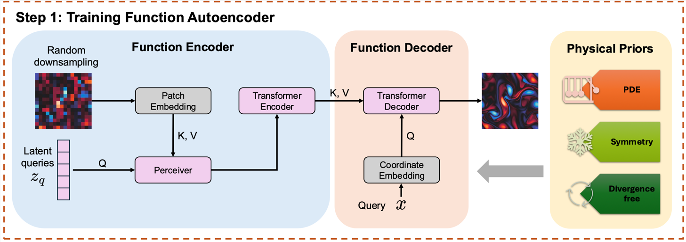
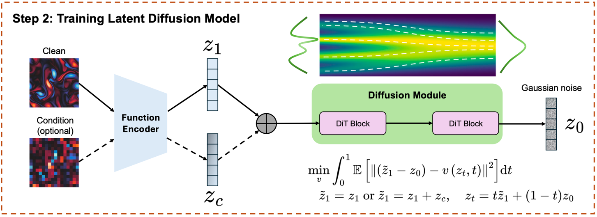
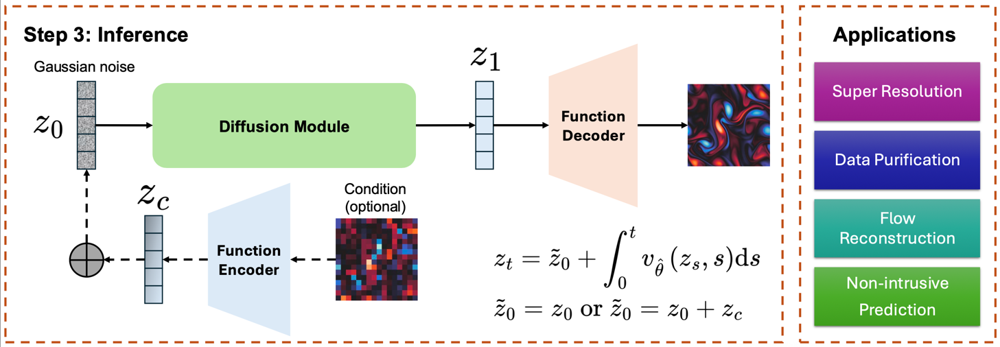

# FunDiff: Diffusion Models over Function Spaces for Physics-Informed Generative Modeling

**Authors:** Sifan Wang*, Zehao Dou*, Tongrui Liu, Lu Lu  
*Equal contribution  

**Affiliation:** Yale University

[//]: # ()
[//]: # (![FunDiff Pipeline]&#40;figures/pipline.png&#41;)

[//]: # ()


## Requirements

This work is implemented using JAX and Flax. Please ensure you have the latest versions of these libraries installed.

## Installation

To install the FunDiff package, clone the repository and install:

```bash
git clone https://github.com/sifanexisted/fundiff.git
cd fundiff
pip install -e .
```

## Dataset

Training datasets are available for download at [dataset link](https://drive.google.com/drive/folders/1GX5uG_3R-yfuP9nMIk0v7ChuEytYwYPW?usp=drive_link). Download and extract the datasets to the appropriate directory and change the data path accordinly in config files before training.

## Training Pipeline





FunDiff employs a two-stage training procedure:

1. **Training Function Autoencoder**: Maps functions to a latent representation 
2. **Training Latent Diffusion Model**: Learns the diffusion process in the latent space via rectified flow


### Example: Burgers flow reconstruction

Navigate to the Kolmogorov flow example directory:

```bash
cd examples/burgers/diffusion
```

#### Step 1: Train Function Autoencoder with PDE constraints

```bash
python main.py --config=configs/autoencoder.py:fae --config.training.use_pde=True
```

This stage learns to encode physical functions into a compact latent representation while preserving essential structural information.

#### Step 2: Train Latent Diffusion Model

```bash
python main.py --config=configs/diffusion.py:fae,dit --config.training.use_pde=True
```

This stage trains the diffusion model to generate new samples in the learned latent space.

### Train other baselines

Go to the `baselines` directory:

```bash
bash cd examples/burgers/baselines
```

Run the following commands to train other baselines (e.g. FNO, Unet, ViT): 

```bash 
python main.py --config=configs/base.py:fno
```


## Evaluation



To evaluate the trained FunDiff model and generate new samples, please check our jupyter notebooks for each example.


<!-- ## Configuration

The training and evaluation processes are controlled through configuration files located in the `configs/` directory. Key parameters include:

- **fae**: Function autoencoder configuration
- **dit**: Diffusion transformer configuration

Modify these configurations to adjust model architecture, training hyperparameters, and evaluation settings. -->

## Repository Structure

```
FunDiff/
├── function_diffusion/         # source code of function diffusion implementation
├── burgers/                    # Burgers equation examples
├── damp_sine/                  # Damped sine wave examples
├── figures/                    # pipline figure
├── kf_generation/              # Kolmogorov flow generation
├── kf_reconstruction/          # Kolmogorov flow reconstruction
├── linear_elasticity/          # Linear elasticity problems
├── turbulence_mass_transfer/   # Turbulence and mass transfer examples
├── requirements.txt            # Python dependencies
└── setup.py                    # Package installation script
```

## Citation

If you use FunDiff in your research, please cite:

```bibtex
@article{wang2025fundiff,
  title={FunDiff: Diffusion Models over Function Spaces for Physics-Informed Generative Modeling},
  author={Wang, Sifan and Dou, Zehao and Liu, Tong-Rui and Lu, Lu},
  journal={arXiv preprint arXiv:2506.07902},
  year={2025}
}
```

